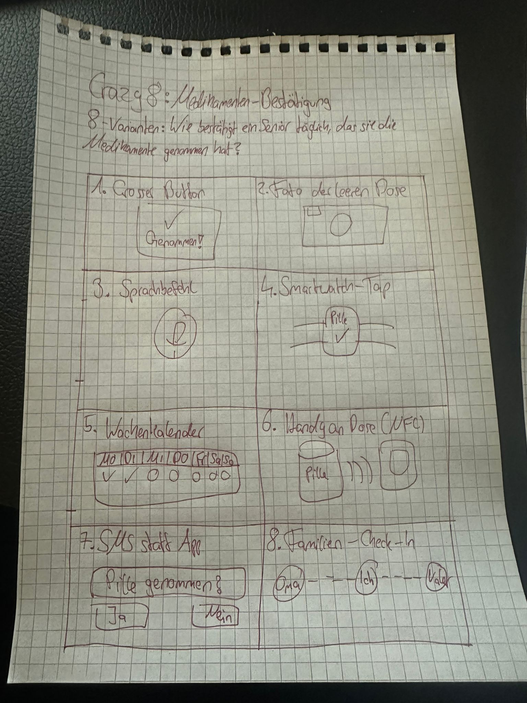
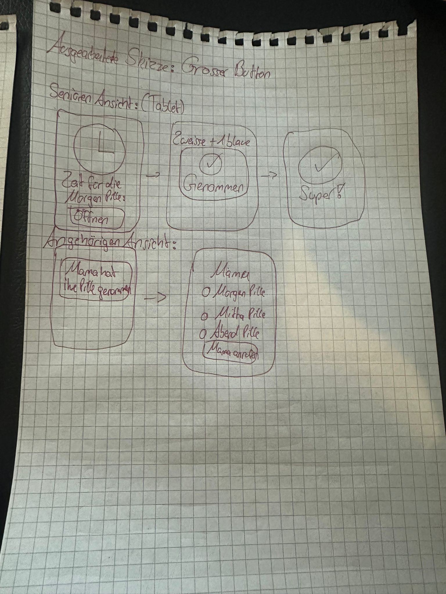
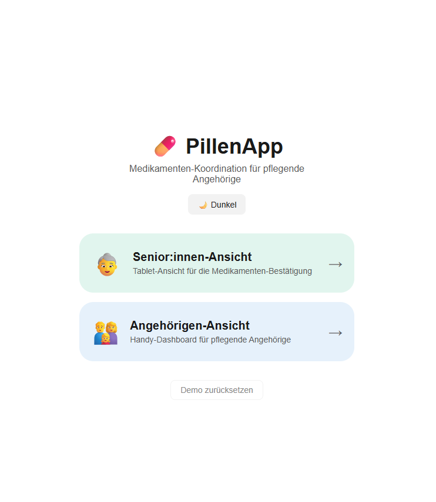
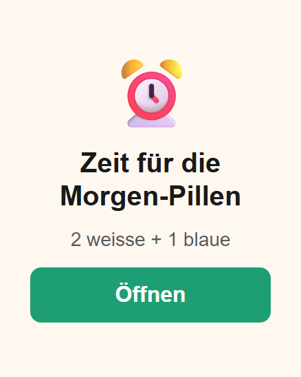
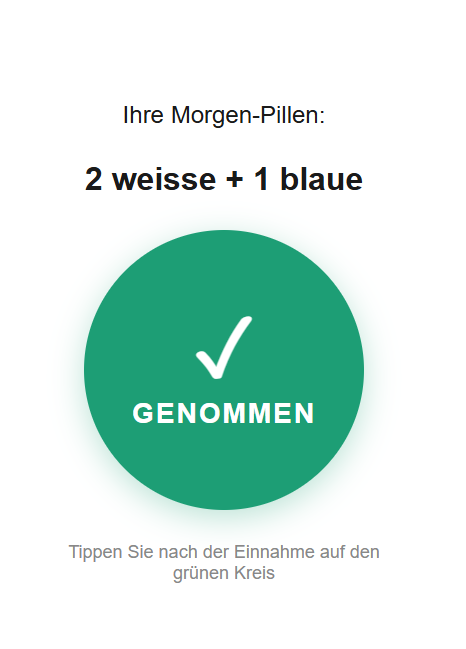
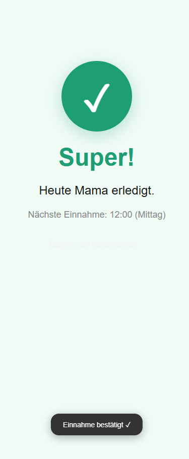
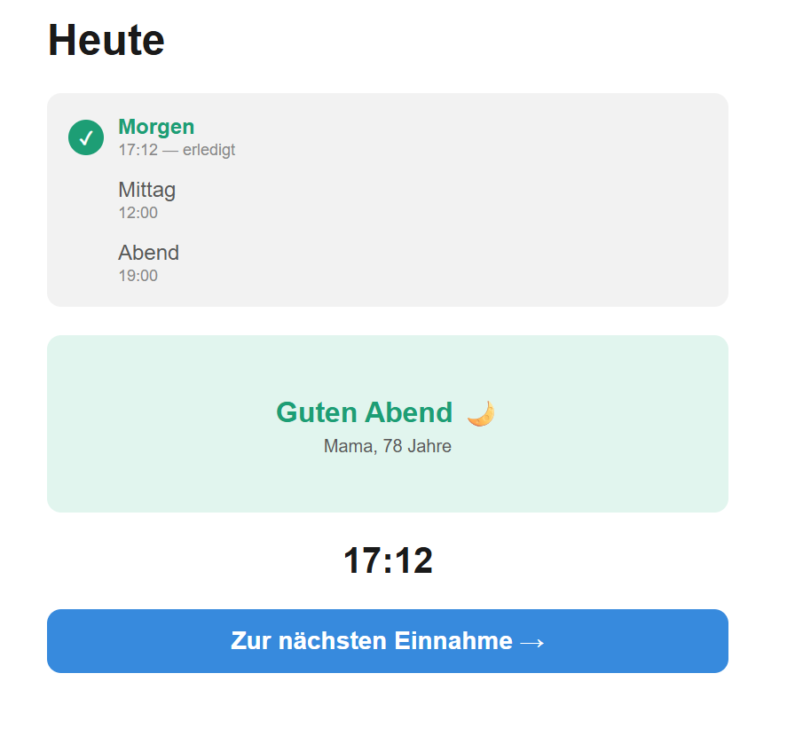
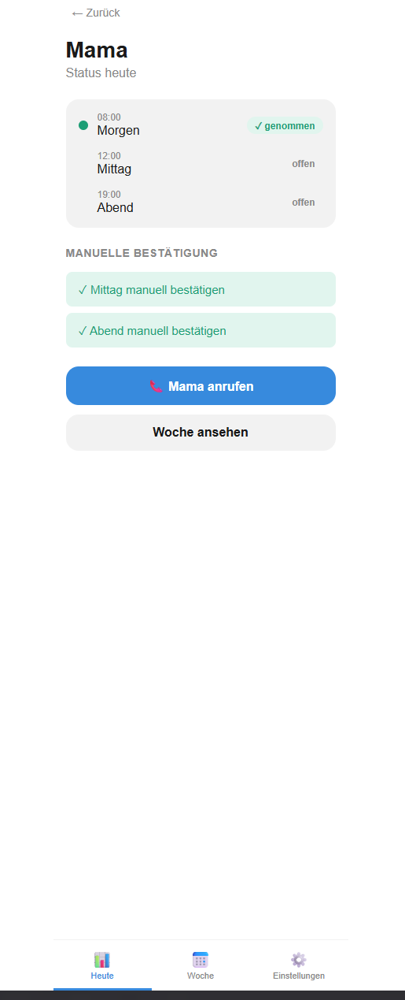
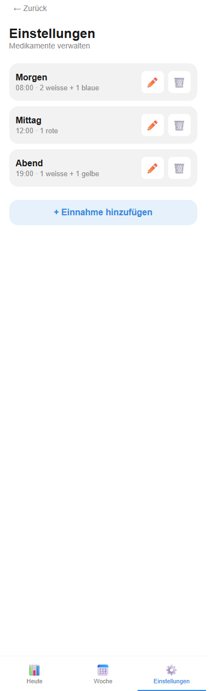

# Projektdokumentation - PillenApp

## Inhaltsverzeichnis

1. [Ausgangslage](#1-ausgangslage)
2. [Lösungsidee](#2-lösungsidee)
3. [Vorgehen & Artefakte](#3-vorgehen--artefakte)
    1. [Understand & Define](#31-understand--define)
    2. [Sketch](#32-sketch)
    3. [Decide](#33-decide)
    4. [Prototype](#34-prototype)
    5. [Validate](#35-validate)
4. [Erweiterungen](#4-erweiterungen)
5. [Projektorganisation](#5-projektorganisation)
6. [KI-Deklaration](#6-ki-deklaration)
7. [Anhang](#7-anhang)

> **Hinweis:** Massgeblich sind die im **Unterricht** und auf **Moodle** kommunizierten Anforderungen.

<!-- WICHTIG: DIE KAPITELSTRUKTUR DARF NICHT VERÄNDERT WERDEN! -->

---

## 1. Ausgangslage

Ältere Menschen, die alleine oder in teilbetreuter Wohnsituation leben, müssen regelmässig mehrere Medikamente einnehmen – oft zu festen Tageszeiten. Die korrekte Einnahme wird dabei häufig vergessen oder unsicher, und pflegende Angehörige haben keine einfache Möglichkeit, den Status aus der Ferne zu überblicken.

- **Problem:** Seniorinnen und Senioren vergessen ihre Medikamente, und Angehörige erfahren davon erst verzögert oder gar nicht. Anrufe zur Kontrolle sind umständlich und erzeugen gegenseitigen Stress.
- **Ziele:**
  - Erinnerung an Medikamenteneinnahme direkt am Tablet der pflegebedürftigen Person
  - Einfache, eigenständige Bestätigung durch die Senior:in per grossem Knopfdruck
  - Transparenter Überblick für Angehörige auf dem Handy (Tages- und Wochenansicht)
  - Eskalationsmechanismus bei ausbleibender Bestätigung
- **Primäre Zielgruppe:** Ältere, pflegebedürftige Menschen (70+) mit eingeschränkter Tech-Affinität sowie deren pflegende Angehörige (30–60 Jahre)
- **Weitere Stakeholder:** Pflegefachpersonen, die den Medikamentenplan hinterlegen

---

## 2. Lösungsidee

PillenApp ist eine webbasierte Zwei-Ansichten-App, die sowohl für die Senior:in (Tablet) als auch für die pflegende Person (Handy) optimiert ist. Beide Seiten sind über einen gemeinsamen Zustand verbunden.

- **Kernfunktionalität:**
  1. **Senior:innen-Flow:** Erinnerungsbildschirm mit Medikamentname und Dosierung → grosser grüner „GENOMMEN"-Knopf zur Bestätigung → Erfolgsanzeige → Ruhezustand mit Uhrzeit
  2. **Angehörigen-Flow:** Dashboard mit aktuellem Tagesstatus → manuelle Bestätigung möglich (Undo per Knopf) → Wochenübersicht → Einstellungen zur Medikamentenverwaltung
  3. **Eskalation:** Wird eine Einnahme nicht innerhalb von 30/60/90 Minuten bestätigt, wechselt der Erinnerungsscreen schrittweise die Darstellung (pulsierendes Icon, Farbwechsel, Warnanzeige im Angehörigen-Dashboard)

- **Annahmen:**
  - Die Senior:in hat dauerhaft Zugriff auf ein Tablet im Haushalt
  - Es gibt eine zuverlässige Internetverbindung für das Deployment (lokal wäre reine localStorage-Nutzung ausreichend)
  - Der Medikamentenplan wird von der pflegenden Person verwaltet, nicht von der Senior:in selbst

- **Abgrenzung:**
  - Keine echten Push-Benachrichtigungen (nur Simulation im Prototyp)
  - Kein Benutzerkonto / Login – Daten werden lokal im Browser gespeichert
  - Keine Anbindung an medizinische Systeme oder externe APIs

---

## 3. Vorgehen & Artefakte

### 3.1 Understand & Define

- **Zielgruppenverständnis:**
  - Seniorinnen und Senioren: geringe Technikaffinität, motorische Einschränkungen (grosse Buttons nötig), Sehschwäche (grosse Schrift), hohe Routine-Abhängigkeit
  - Pflegende Angehörige: häufig berufstätig, nutzen Handy unterwegs, wollen schnellen Status auf einen Blick, nicht täglich anrufen müssen
  - Proto-Persona Senior: «Mama», 78 Jahre, lebt alleine, nimmt 3× täglich Medikamente
  - Proto-Persona Angehörige: Tochter, 45 Jahre, berufstätig, lebt 20 Minuten entfernt

- **Wesentliche Erkenntnisse:**
  - Grosse, kontrastreiche UI-Elemente sind für Senior:innen entscheidend
  - Angehörige wollen Transparenz, ohne aktiv nachfragen zu müssen
  - Eskalation muss sanft beginnen und erst bei längerem Ausbleiben eskalieren
  - Undo-Funktion ist wichtig – versehentliche Bestätigungen kommen vor
  - Die App muss auch ohne technisches Vorwissen sofort bedienbar sein

---

### 3.2 Sketch

- **Variantenüberblick (Crazy 8s – Feature: Medikamenten-Bestätigung)**  
  Zentrale Frage: *Wie bestätigt ein Senior täglich, dass er/sie die Medikamente genommen hat?*

  

  | # | Variante | Beschreibung |
  |---|---|---|
  | 1 | **Grosser Button** (gewählt) | Grosser „✓ Genommen!"-Button auf dem Tablet |
  | 2 | Foto der leeren Dose | Senior fotografiert die leere Pillendose |
  | 3 | Sprachbefehl | Bestätigung per Mikrofon/Sprache |
  | 4 | Smartwatch-Tap | Kurzer Tap auf die Smartwatch |
  | 5 | Wochenkalender | Tagesfeld im Kalender abhaken |
  | 6 | Handy an Dose (NFC) | Handy an NFC-Chip an der Pillendose halten |
  | 7 | SMS statt App | SMS-Antwort «Ja» auf automatische Nachfrage |
  | 8 | Familien-Check-In | Bestätigung im Familien-Gruppenchat |

- **Unterschiede & Entscheidungsgrundlage:**
  - Varianten 2–4 erfordern Hardware (Kamera, Smartwatch, NFC) oder technisches Setup
  - Varianten 7–8 sind nicht in der App integrierbar und verlangen aktives Handeln ohne visuelles Feedback
  - Variante 1 («Grosser Button») ist sofort verständlich, braucht kein Zusatzgerät und ist für die Zielgruppe 70+ optimal bedienbar
  - Variante 5 (Wochenkalender) floss als Angehörigen-Feature ins finale Konzept ein

---

### 3.3 Decide

- **Gewählte Variante & Begründung:** Variante B (getrennte Ansichten mit Rollenauswahl). Die Entscheidungskriterien waren:
  1. **Zugänglichkeit:** Die Senior:innen-Ansicht kann radikal vereinfacht werden (wenige, sehr grosse Bedienelemente), ohne die Angehörigen-Funktionen zu verstecken
  2. **Zielgruppengerechtes Design:** Keine kognitive Überlastung der Senior:in durch komplexe Navigation
  3. **Umsetzbarkeit im Prototyp:** Realisierbar als Single-Page-App mit SvelteKit-Routing, ohne separates Backend

- **End-to-End-Ablauf:**
  1. Startseite → Rollenauswahl
  2. *Senior:in:* Tablet zeigt Erinnerungsscreen zur Einnahmezeit → Öffnen → Bestätigen → Erfolgsanzeige → Ruhezustand (mit Uhrzeit und Tagesübersicht)
  3. *Angehörige:* Dashboard zeigt Tagesstatus der Einnahmen → manuelle Bestätigung bei Bedarf → Wochenübersicht → Medikamente verwalten in Einstellungen

- **Ausgearbeitete Skizze (Variante B – Grosser Button):**

  

  *Senior:innen-Flow (Tablet):* Erinnerungsscreen «Zeit für die Morgen-Pillen» + Öffnen-Button → Bestätigungsscreen mit Dosierungsangabe + grossem ✓-Button → Erfolgsscreen «Super!»  
  *Angehörigen-Flow (Handy):* Push «Mama hat ihre Pille genommen» → Dashboard mit Tagesübersicht (Morgen-/Mittag-/Abendpille) + Anruf-Button

- **Mockup (digital, interaktiv):** [Figma-Prototyp](https://www.figma.com/proto/fXUXmPGM1d5MCwYub4oKCH/Pillenapp?node-id=2-208&p=f&t=8hCuYMPkILDGHkyF-1&scaling=scale-down&content-scaling=fixed&page-id=1%3A3037&starting-point-node-id=2%3A185&show-proto-sidebar=1)

---

### 3.4 Prototype

#### 3.4.1. Entwurf (Design)

- **Informationsarchitektur:**
  ```
  / (Rollenauswahl)
  ├── /senior/erinnerung      ← Erinnerungsanzeige mit Eskalationsstufen
  ├── /senior/bestaetigung    ← Bestätigungsknopf
  ├── /senior/erfolg          ← Erfolgsmeldung (Auto-Redirect)
  └── /senior/ruhezustand     ← Ruhemodus mit Tagesübersicht und Uhrzeit
  
  └── /angehoerige/dashboard  ← Tagesstatus, manuelle Aktionen
      ├── /angehoerige/woche  ← Wochenhistorie
      └── /angehoerige/einstellungen ← Medikamentenverwaltung (CRUD)
  ```

- **User Interface Design – wichtige Screens:**

  **Senior:innen-Flow (Tablet-optimiert)**

  | Startseite | Erinnerung | Bestätigung |
  |:---:|:---:|:---:|
  |  |  |  |
  | Rollenauswahl mit zwei grossen Karten | Erinnerungsscreen mit Dosierungsangabe und Eskalationsanzeige | 280×280px runder «✓ GENOMMEN»-Knopf |

  | Erfolg | Ruhezustand |
  |:---:|:---:|
  |  |  |
  | Bestätigungsquittung, Auto-Redirect nach 3 Sek. | Tagesübersicht mit Uhrzeit und Tagesgruss |

  **Angehörigen-Flow (Handy-optimiert)**

  | Dashboard | Einstellungen |
  |:---:|:---:|
  |  |  |
  | Tagesstatus, manuelle Bestätigung, Undo, Anruf | CRUD-Verwaltung des Medikamentenplans |

- **Designentscheidungen:**
  - **Keine externe UI-Bibliothek:** Vollständig mit CSS Custom Properties umgesetzt – gibt maximale Kontrolle über Barrierefreiheit und Grössen
  - **Dark Mode:** Via CSS-Klasse `.dark` auf `<body>`, persistiert in localStorage – wichtig für Abendnutzung
  - **Farbsystem:** Semantische Farben (success = grün, warning = orange, danger = rot) als CSS-Variablen, sodass beide Ansichten konsistent wirken
  - **Kontrastreiche Typografie:** Basis-Schriftgrössen 18–48px im Senior-Bereich, System-Font (Arial/Helvetica) für maximale Lesbarkeit ohne externe Ladeverzögerung

#### 3.4.2. Umsetzung (Technik)

- **Technologie-Stack:**
  | Technologie | Version | Zweck |
  |---|---|---|
  | SvelteKit | 2.57 | App-Framework, Routing, SSR/SSG |
  | Svelte | 5.55 | Reaktivität (`$state`, `$derived`), Komponenten |
  | Vite | 8.x | Dev-Server, Build-Tool |
  | TypeScript / JSDoc | 6.x | Typen ohne separaten Compile-Schritt |
  | `@sveltejs/adapter-netlify` | 6.x | Deployment-Adapter |

  Keine externen UI-Bibliotheken, keine CSS-Frameworks.

- **Tooling:**
  - IDE: VS Code mit den Extensions Svelte for VS Code, ESLint
  - Claude Code (AI-Assistent, siehe Kap. 6)
  - Deployment: Netlify (automatisch via Git-Push)

- **Struktur & Komponenten:**

  *Seiten (routes):*
  | Route | Beschreibung |
  |---|---|
  | `/` | Rollenauswahl, Dark-Mode-Toggle, Demo-Reset |
  | `/senior/erinnerung` | Erinnerung mit 3-stufiger Eskalation (30/60/90 Min.) |
  | `/senior/bestaetigung` | Bestätigungsknopf (grosser runder Button) |
  | `/senior/erfolg` | Erfolgsmeldung, Auto-Redirect nach 3 Sekunden |
  | `/senior/ruhezustand` | Ruhemodus – Uhrzeit, Tagesübersicht, Tagesgruss |
  | `/angehoerige/dashboard` | Tagesstatus, manuelle Bestätigung, Undo, Anruf |
  | `/angehoerige/woche` | Wochenhistorie mit Fortschrittsbalken |
  | `/angehoerige/einstellungen` | CRUD-Verwaltung des Medikamentenplans |

  *Komponenten (`src/lib/components`):*
  | Komponente | Beschreibung |
  |---|---|
  | `MedikamentListe.svelte` | Wiederverwendete Timeline-Liste (prop `mode`: `senior` / `angehoerige`) |
  | `BottomTabBar.svelte` | Tab-Navigation (Heute / Woche / Einstellungen) in der Angehörigen-Ansicht |
  | `BackLink.svelte` | Einheitlicher Zurück-Link oben links |
  | `StatusBadge.svelte` | Farbige Status-Anzeige (offen / genommen / verpasst) |
  | `PushNotification.svelte` | Simuliertes Push-Banner beim ersten Öffnen des Dashboards |
  | `Toast.svelte` | Feedback-Meldungen (erscheint kurz, verschwindet automatisch) |

  *Stores (`src/lib/stores/medikamente.js`):*
  | Store | Typ | Persistiert | Beschreibung |
  |---|---|---|---|
  | `einnahmen` | `writable` | localStorage | Medikamentenliste mit Status |
  | `wochenHistorie` | `writable` | localStorage | Einnahmestatus Mo–So |
  | `person` | `writable` | nein | Name und Alter der Senior:in |
  | `eskalationStart` | `writable` | localStorage | Startzeitpunkt der Eskalation (ms) |
  | `lastBestaetigt` | `writable` | nein | Letzte Bestätigung für Undo-Funktion |
  | `darkMode` | `writable` | localStorage | Dark-Mode-Zustand |
  | `naechsteEinnahme` | `derived` | – | Nächste offene Einnahme (abgeleitet) |

- **Daten & Schnittstellen:**
  - Kein Backend, kein API-Aufruf – alle Daten leben im `localStorage` des Browsers
  - Initialzustand aus `src/lib/data/dummy.js` (3 Einnahmen: Morgen 08:00, Mittag 12:00, Abend 19:00)
  - Persistenz-Utility `persist()`: wrapper um `writable`, schreibt bei jeder Änderung in localStorage und lädt beim Start
  - «Demo zurücksetzen»-Funktion setzt alle Einnahmen auf Status «offen» zurück

- **Deployment:**
  - URL: https://pillapp-zhaw.netlify.app
  - Build-Befehl: `npm run build`
  - Publish-Verzeichnis: `build`
  - Konfiguration: `netlify.toml` im Repo-Root

- **Besondere Entscheidungen:**
  - **Svelte 5 Runes** (`$state`, `$derived`): Bewusst die neue Svelte-5-Syntax gewählt für klareren reaktiven Code ohne `$:` oder `store.subscribe()`
  - **Kein Login / keine Auth**: Für den Prototypen bewusst weggelassen – vereinfacht Testing und Deployment erheblich; in einem echten Produkt würde hier mindestens eine PIN-Sperre für den Angehörigen-Bereich folgen
  - **Eskalation im Frontend**: Die Eskalationslogik (30/60/90 Min.) läuft vollständig im Browser mit `setInterval`. In einer Produktionslösung würden serverseitige Benachrichtigungen via Push API oder SMS nötig

---

### 3.5 Validate

- **URL der getesteten Version:** https://pillapp-zhaw.netlify.app

- **Ziele der Prüfung:**
  - H01: Wird der GENOMMEN-Kreis von der Senior:in ohne Erklärung erkannt und gedrückt?
  - H02: Ist der Status «offen» vs. «verpasst» für Angehörige eindeutig lesbar?
  - H03: Ist die Rollenauswahl auf der Startseite (zwei Geräte) klar verständlich?
  - H04: Wird die simulierte Push-Notification als solche erkannt (nicht als Fehler)?
  - H05: Ist der Senior:in klar, dass die Angehörige nach der Bestätigung informiert wird?

- **Vorgehen:** Moderierter Think-Aloud-Test, on-site; beide Rollen (Angehörige + Senior:in) rollenbasiert durchgespielt · Datum: 20.05.2026

- **Stichprobe:**
  - Luis, 25 Jahre, Kommilitone ZHAW, hohe Smartphone-Affinität
  - Valdrin, 26 Jahre, Kommilitone ZHAW, hohe Smartphone-Affinität

- **Aufgaben/Szenarien:**

  *Szenario Angehörige* – «Du kümmerst dich um deine Mutter (78), die täglich Medikamente nehmen muss. Du wohnst nicht bei ihr.»

  | Aufgabe | Situation | Ziel |
  |---|---|---|
  | A1 – Erster Eindruck | App zum ersten Mal geöffnet | Was siehst du? Was tust du als nächstes? |
  | A2 – Tagesstatus | Dienstagvormittag, noch keine Nachricht von Mama | Finde heraus ob sie heute Morgen ihre Medikamente genommen hat |
  | A3 – Wochenübersicht | Wie zuverlässig war sie diese Woche? | Verschaffe dir einen Wochenüberblick |
  | A4 – Kontakt | Mama hat noch nicht bestätigt | Nimm über die App Kontakt auf |
  | A5 – Eskalation | Plötzliche Meldung der App bei der Arbeit | Was bedeutet die Meldung? Was tust du jetzt? |

  *Szenario Senior:in* – «Du bist 78 und nimmst täglich Tabletten. Deine Tochter hat dir ein Tablet mit der App hingestellt.»

  | Aufgabe | Situation | Ziel |
  |---|---|---|
  | S1 – Erinnerung | Tablettenzeit, die App zeigt etwas an | Was siehst du? Was machst du? |
  | S2 – Bestätigen | Tabletten gerade genommen | Sag der App dass du sie genommen hast |
  | S3 – Feedback | Nach der Bestätigung | Was zeigt die App jetzt? Was bedeutet das? |

- **Kennzahlen & Beobachtungen:**

  *Was gut lief:*
  - GENOMMEN-Kreis sofort erkannt und gedrückt («klar, das drückt man»)
  - Anruf-Button blitzschnell gefunden, kam bei beiden gut an
  - Wochenübersicht ohne Erklärung richtig gelesen, Farben selbsterklärend
  - Erfolgs-Screen optisch positiv aufgenommen

  *Gefundene Usability-Issues:*

  | ID | Wo | Aufgabe | Problem | Schweregrad | Wer |
  |---|---|---|---|---|---|
  | U01 | Startseite | A1, S1 | Beide unsicher ob die zwei Ansichten auf einem oder zwei Geräten laufen | **3** gross | beide |
  | U02 | Dashboard | A2 | «offen» unklar – «noch nicht fällig» oder «ausständig»? | **2** klein | beide |
  | U03 | Senior – Erinnerung | S2 | «Öffnen»-Button ~10 Sek. Zögerung: «Was öffne ich da?» – GENOMMEN-Kreis danach sofort klar | **3** gross | beide |
  | U04 | Senior – Erfolg | S3 | Beide fragten direkt: «Weiss jetzt meine Tochter Bescheid?» | **3** gross | beide |
  | U05 | Dashboard – Alert | A5 | Rote Eskalations-Box gesehen, Dringlichkeit verstanden – aber kein klarer nächster Schritt | **2** klein | beide |
  | U06 | Senior – Ruhezustand | S1 | Kurze Orientierungszeit um zur Erinnerung zu navigieren | **2** klein | beide |

  *Issue Map:*

<table>
<thead>
<tr>
  <th></th>
  <th>Startseite</th>
  <th colspan="2">Senior – Erinnerung</th>
  <th colspan="2">Senior – Bestätigung / Erfolg</th>
  <th colspan="2">Angehörige – Dashboard</th>
  <th>Wochenübersicht</th>
</tr>
<tr>
  <th></th>
  <th><em>Rollenaufteilung &amp; Gerätezuordnung verstehen</em></th>
  <th><em>Zur Bestätigung navigieren</em></th>
  <th><em>Aus Ruhezustand navigieren</em></th>
  <th><em>Einnahme bestätigen</em></th>
  <th><em>Feedback: Angehörige informiert?</em></th>
  <th><em>Tagesstatus lesen</em></th>
  <th><em>Eskalation einordnen &amp; reagieren</em></th>
  <th><em>Wochenüberblick gewinnen</em></th>
</tr>
</thead>
<tbody>
<tr>
  <td><strong>Luis</strong></td>
  <td>🔴 «Läuft das auf einem Gerät?» <em>(U01)</em></td>
  <td>🔴 «Öffnen? Was öffne ich da – die Pillendose?» ~10 Sek. Zögerung <em>(U03)</em></td>
  <td>🟡 Kurze Orientierungszeit <em>(U06)</em></td>
  <td>🟢 Sofort erkannt und gedrückt</td>
  <td>🔴 «Aber weiss jetzt meine Tochter Bescheid?» <em>(U04)</em></td>
  <td>🔴 «offen» unklar – nicht fällig oder ausständig? <em>(U02)</em></td>
  <td>🔴 Dringlichkeit klar, kein nächster Schritt sichtbar <em>(U05)</em></td>
  <td>🟢 Farben selbsterklärend, sofort richtig gelesen</td>
</tr>
<tr>
  <td><strong>Valdrin</strong></td>
  <td>🔴 Zögerte bei Rollenauswahl <em>(U01)</em></td>
  <td>🔴 «'Öffnen' ist komisch. Aber dann der grosse Knopf – klar.» <em>(U03)</em></td>
  <td>🟡 Brauchte kurz für Navigation <em>(U06)</em></td>
  <td>🟢 «Dann der grosse Knopf – klar»</td>
  <td>🔴 «Weiss meine Tochter Bescheid oder muss ich ihr noch schreiben?» <em>(U04)</em></td>
  <td>🔴 «'Offen' – hat sie's noch nicht gemacht oder verpasst?» <em>(U02)</em></td>
  <td>🔴 «Ich seh dass es dringend ist aber was tu ich jetzt?» <em>(U05)</em></td>
  <td>🟢 Fortschrittsbalken und Farbkodierung sofort verstanden</td>
</tr>
</tbody>
</table>

  🟢 funktioniert gut &nbsp;&nbsp; 🟡 kleines Problem &nbsp;&nbsp; 🔴 grosses Problem

  *Hypothesen-Check:*

  | ID | Hypothese | Ergebnis |
  |---|---|---|
  | H01 | GENOMMEN-Kreis nicht erkannt | **nicht bestätigt** – sofort gedrückt; Problem war der «Öffnen»-Button davor → U03 |
  | H02 | «offen» vs. «verpasst» unklar | **bestätigt** → U02 |
  | H03 | Startseite mit zwei Ansichten verwirrend | **bestätigt** → U01 |
  | H04 | Push-Notification nicht als simuliert erkannt | **nicht bestätigt** – kein Problem |
  | H05 | Senior:in unsicher ob Angehörige Bescheid bekommt | **bestätigt** → U04 |

- **Zusammenfassung der Resultate:** Der Kern-Flow (Erinnerung → Bestätigung → Erfolg) funktioniert intuitiv – der GENOMMEN-Kreis wurde von beiden Testpersonen sofort und ohne Erklärung gedrückt. Die grössten Schwachstellen liegen bei der fehlenden Kontextualisierung: Nutzende verstehen nicht von Anfang an, dass Senior- und Angehörigen-Ansicht auf verschiedenen Geräten laufen (U01), und die Senior:in weiss nach der Bestätigung nicht, ob die Angehörige informiert wird (U04). Der «Öffnen»-Button vor dem Bestätigungs-Screen schafft unnötige Unsicherheit (U03).

- **Abgeleitete Verbesserungen:**

  | Priorität | Massnahme | Issue | Aufwand |
  |---|---|---|---|
  | Hoch | «[Name] wurde benachrichtigt ✓» auf Erfolgs-Screen ergänzen | U04 | S |
  | Hoch | Gerätezuordnung auf Startseite erklären: «Senior-Ansicht → Tablet · Angehörigen-Ansicht → Handy» | U01 | S |
  | Hoch | «Öffnen»-Button umbenennen («Weiter» / «Pillen nehmen») oder Screens zusammenlegen | U03 | M |
  | Mittel | «offen» → «ausstehend» im Dashboard | U02 | S |
  | Mittel | Anruf-Button direkt in Eskalations-Alert integrieren | U05 | S |
  | Niedrig | Auto-Redirect zur Erinnerung wenn Einnahme fällig | U06 | M |

---

## 4. Erweiterungen

### 4.1 Dreistufiges Eskalationssystem

- **Beschreibung & Nutzen:** Wird eine Einnahme nicht bestätigt, eskaliert die App schrittweise: nach 30 Minuten beginnt das Uhr-Icon zu pulsieren, nach 60 Minuten wechselt der Hintergrund zu einem wärmeren Orange-Ton, nach 90 Minuten erscheint eine explizite Warnmeldung im Senior- und Angehörigen-Interface. Dies erhöht die Aufmerksamkeit, ohne von Beginn an alarmierend zu wirken.
- **Wo umgesetzt:**
  - **Frontend:** `src/routes/senior/erinnerung/+page.svelte` – `setInterval` berechnet Minuten seit `eskalationStart`, CSS-Klassen `stufe1`/`stufe2` ändern Hintergrundfarbe; `src/routes/angehoerige/dashboard/+page.svelte` – Eskalations-Badge mit `aria-live="assertive"`
  - **Store:** `eskalationStart` in `src/lib/stores/medikamente.js` – persistiert in localStorage, damit auch nach Browser-Reload die Eskalation weiterzählt
- **Referenz:** Kap. 3.4.1 (Designentscheidungen), Erinnerungsscreen-Beschreibung
- **Aus Evaluation abgeleitet?:** Nein – im Designprozess als Kernanforderung definiert

### 4.2 Undo-Funktion für Bestätigungen

- **Beschreibung & Nutzen:** Direkt nach einer Bestätigung (ob durch die Senior:in oder manuell durch Angehörige) erscheint im Dashboard ein «Undo»-Button für 30 Sekunden. Damit können Fehleingaben sofort rückgängig gemacht werden, ohne den kompletten Demo-Reset ausführen zu müssen.
- **Wo umgesetzt:**
  - **Frontend:** `src/routes/angehoerige/dashboard/+page.svelte` – Undo-Button erscheint reaktiv, wenn `$lastBestaetigt` einen Wert hat
  - **Store:** `lastBestaetigt` und `undoBestaetigen()` in `src/lib/stores/medikamente.js`; `setTimeout` nach 30 Sekunden setzt `lastBestaetigt` zurück
- **Referenz:** Kap. 3.4.2 (Store-Beschreibung)
- **Aus Evaluation abgeleitet?:** Nein – präventiv implementiert nach Nutzungsszenario-Analyse

### 4.3 Vollständige CRUD-Verwaltung des Medikamentenplans

- **Beschreibung & Nutzen:** Angehörige können im Einstellungs-Screen Einnahmen hinzufügen, bearbeiten und löschen. Das Formular validiert Pflichtfelder (Name, Uhrzeit) und gibt direkte Fehlermeldungen aus. Dies macht den Prototyp auch für verschiedene Testdatensätze flexibel nutzbar.
- **Wo umgesetzt:**
  - **Frontend:** `src/routes/angehoerige/einstellungen/+page.svelte` – vollständiges Formular mit `bind:value`, Fehleranzeige via `role="alert"`, inline Validierung
  - **Store:** `einnahmeHinzufuegen()`, `einnahmeBearbeiten()`, `einnahmeLoeschen()` in `src/lib/stores/medikamente.js`
- **Referenz:** Kap. 3.4.1 (Informationsarchitektur), Kap. 3.4.2 (Route-Übersicht)
- **Aus Evaluation abgeleitet?:** Nein – als Grundfunktionalität für den Prototyp konzipiert

### 4.4 Dark Mode

- **Beschreibung & Nutzen:** Per Toggle auf der Startseite wechselt die gesamte App in den Dark Mode. Gerade für Abendeinnahmen reduziert dies die Blendwirkung auf Senior:innen erheblich. Der Zustand wird in localStorage gespeichert und bleibt nach Browser-Reload erhalten.
- **Wo umgesetzt:**
  - **Frontend:** `src/routes/+layout.svelte` – CSS-Klasse `.dark` wird reaktiv auf `<body>` gesetzt; `src/app.css` – vollständiges Dark-Mode-Farbschema via CSS Custom Properties (alle `--color-*`-Variablen überschrieben)
  - **Store:** `darkMode` in `src/lib/stores/medikamente.js`
- **Referenz:** Kap. 3.4.1 (Designentscheidungen)
- **Aus Evaluation abgeleitet?:** Nein – benutzergetrieben aus Zugänglichkeitsüberlegungen

---

## 5. Projektorganisation

- **Repository:** Git-Repository, initialisiert auf `main`-Branch
- **Commit-Praxis:** Sprechende Commit-Messages auf Deutsch, ein Commit pro abgeschlossener Funktionseinheit (z. B. «Netlify adapter hinzugefügt», «Projekt initialisiert»)
- **Projektstruktur:**
  ```
  src/
  ├── app.css              ← Globale CSS-Variablen und Reset
  ├── app.html             ← HTML-Shell
  ├── lib/
  │   ├── components/      ← Wiederverwendbare Svelte-Komponenten
  │   ├── data/dummy.js    ← Initialdaten für Demo
  │   └── stores/          ← Svelte-Stores (State-Management)
  └── routes/
      ├── +layout.svelte   ← Dark-Mode-Wrapper
      ├── +page.svelte     ← Startseite / Rollenauswahl
      ├── senior/          ← Senior:innen-Flow
      └── angehoerige/     ← Angehörigen-Flow
  ```

---

## 6. KI-Deklaration

### 6.1 KI-Tools

- **Eingesetzte Tools:**
  - Claude Code (Anthropic, claude-sonnet-4-6) – KI-Assistent direkt in der IDE (VS Code Extension)

- **Zweck & Umfang:**
  - **Code-Generierung:** Svelte-Komponenten, Store-Logik, CSS-Styling wurden mit Claude Code entwickelt. Der Grossteil des Codes in `src/lib/stores/medikamente.js`, `src/lib/components/*.svelte` sowie den Routen-Dateien entstand mit KI-Unterstützung oder wurde durch KI-Vorschläge erheblich beschleunigt.
  - **Architektur:** Die Entscheidungen zu Routing, Store-Struktur und Datenfluss wurden menschlich getroffen und mit der KI umgesetzt.
  - **Debugging:** Fehler in Svelte-5-Rune-Syntax (`$state`, `$derived`) wurden mit KI-Hilfe identifiziert und behoben.
  - **Dokumentation:** Diese README wurde auf Basis des Projekts mit KI-Unterstützung erstellt.

- **Eigene Leistung (Abgrenzung):**
  - Konzept, Problemdefinition, Zielgruppenanalyse und Designentscheidungen (Was wird gebaut? Für wen? Warum zwei Ansichten?) wurden eigenständig erarbeitet.
  - Auswahl des Tech-Stacks (SvelteKit, keine UI-Bibliothek, localStorage) erfolgte eigenständig.
  - Alle KI-generierten Code-Vorschläge wurden geprüft, angepasst und bewusst integriert. Kein Code wurde ungeprüft übernommen.
  - Testing und Nutzungsszenarien stammen eigenständig.

### 6.2 Prompt-Vorgehen

Die Zusammenarbeit mit Claude Code erfolgte iterativ und kontextbasiert: Zunächst wurde die gewünschte Funktionalität beschrieben («Erstelle eine Senior-Ansicht mit grossem Bestätigungsknopf und Eskalationslogik»), danach wurden konkrete Code-Segmente angefragt und überprüft. Korrekturen erfolgten durch präzisierte Follow-up-Prompts («Der Hintergrund soll erst nach 60 Minuten orange werden, nicht sofort»). Für Stores und Datenfluss wurde zuerst das Datenmodell mündlich geklärt, bevor die Implementierung beauftragt wurde.

Qualitätssicherung: Jeder generierte Code wurde im Browser getestet und auf Verständlichkeit überprüft. KI-generierte Kommentare wurden weitgehend entfernt, da der Code selbsterklärend gestaltet ist.

### 6.3 Reflexion

**Nutzen:** Claude Code hat die Entwicklungszeit drastisch reduziert – besonders bei repetitiven CSS-Strukturen und Svelte-5-spezifischer Syntax, die noch wenig dokumentiert ist. Die Kombination aus eigenem Konzept und KI-gestützter Umsetzung ermöglichte es, in kurzer Zeit einen voll funktionsfähigen Prototypen zu erstellen.

**Grenzen:** Bei sehr spezifischen Zugänglichkeitsanforderungen (korrekte ARIA-Rollen, `aria-live`-Regionen) musste manuell nachgebessert werden. Die KI neigt dazu, Code zu generieren, der syntaktisch korrekt ist, aber nicht immer die pädagogisch beste Lösung darstellt.

**Risiken & Qualitätssicherung:** Das grösste Risiko ist die unkritische Übernahme von Code. Dagegen wurde angegangen durch: manuelle Tests nach jeder Komponente, Lesen und Verstehen des generierten Codes, und gezieltes Hinterfragen von Entscheidungen («Warum hast du hier `onMount` statt `$effect` verwendet?»).

---

## 7. Anhang

- **Quellen:**
  - SvelteKit-Dokumentation: https://kit.svelte.dev/docs
  - Svelte 5 Runes: https://svelte.dev/docs/svelte/what-are-runes
  - Netlify Adapter: https://kit.svelte.dev/docs/adapter-netlify
  - CSS Custom Properties (MDN): https://developer.mozilla.org/en-US/docs/Web/CSS/Using_CSS_custom_properties

- **Testskript & Materialien:** *(nach Testdurchführung verlinken)*
- **Rohdaten/Auswertung:** *(nach Testdurchführung verlinken)*
